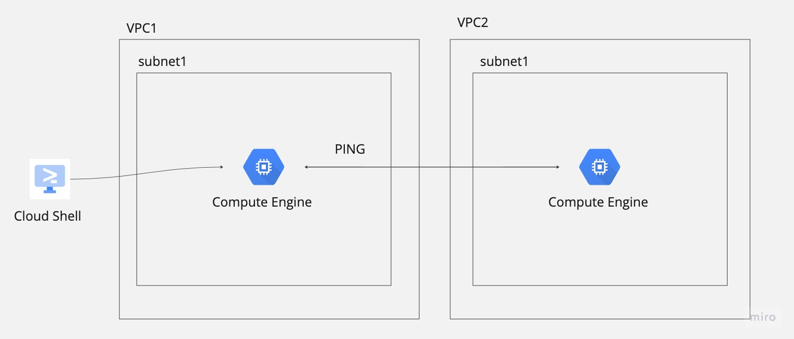

# feat-00012 [Create vpc-peering and compute engine using terraform]
 - tasks: create vpc-peering and compute engines
 - provider: google-cloud
 - resource: vpc, subnet, compute enging

## Architecture
